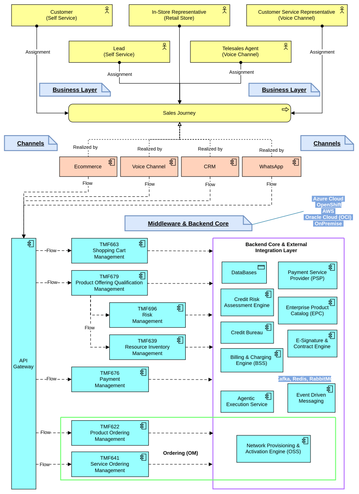

# Hi there! I'm Alex Daniel M. 👋

## 🏗️ Solutions Architect | Software Engineer & Agentic AI Integration
Solutions Architect specializing in designing distributed, high-scale ecosystems, Headless decoupling, and complex workflow automation. Focused on bridging global industry standards—such as **TM Forum (ODA / Open APIs)**—with modern microservices architectures and **Agentic AI integrations** for the Enterprise and Telco sectors.

* **Website:** [innosk.com](https://innosk.com)
* **LinkedIn:** [alex-daniel-meza-lopez](https://linkedin.com/in/alex-daniel-meza-lopez)
* **Email:** alexdanielmeza@gmail.com

---

## 🛠️ Tech Stack & Core Competencies

* **Architecture & Standards:** TM Forum (ODA / Open APIs), ArchiMate, C4 Model, Domain-Driven Design (DDD), Hexagonal & Clean Architecture, Event-Driven Systems (EDA).
* **AI & Agentic Systems:** Agentic Workflow Automation, Model Context Protocol (MCP Servers), Tool & Skill Definition, Multi-Model Orchestration (OpenRouter/OpenCode integration).
* **Backend & Runtimes:** Node.js, TypeScript, Fastify, NestJS, Bun, Prisma ORM, Zod, Oracle Service Bus (OSB 12c), WebLogic 12c.
* **Integration & E-Commerce:** Headless Commerce (Medusa.js pattern), Omnichannel CRM, API Gateways, REST/GraphQL, SOAP/WSDL/XML.
* **Infrastructure & DevOps:** AWS, LocalStack, Docker, Docker Compose, NGINX, Cloudflare, Linux.

---

## 🚀 Featured Architectural Blueprints

### 1. Enterprise Omnichannel Sales Journey (TM Forum ODA)
> Architectural blueprint for a Tier-1 Telco-grade headless sales journey. It maps omnichannel interactions through an API Gateway to TM Forum Open APIs, orchestrating credit risk scoring, IMEI validation, and underlying BSS/OSS provisioning.

#### 📌 Key Architectural Highlights
* **Decoupled Experience Layer:** Omnichannel capability (Web, WhatsApp, CRM, Voice Channel) is fully decoupled from core business logic using an API Gateway facade.
* **TM Forum Open API Alignment:** Standardized API wrappers for cart state (`TMF663`), product offering qualification (`TMF679`), credit risk scoring (`TMF670/TMF696`), device resource checks (`TMF639`), payment management (`TMF676`), and order fulfillment (`TMF622`/`TMF641`).
* **Core Systems Isolation:** Seamless abstraction of legacy BSS/OSS engines, credit bureaus, and external PSPs behind vendor-agnostic Open APIs.

---

### 2. Micro-SaaS & Automation Architecture: Innosk Lab
> Modular automation architecture and API-first services designed for rapid product deployment and event-driven workflows.

---

## 🌐 Let's Connect

---
*Designing resilient architectures and scalable systems, one module at a time.*